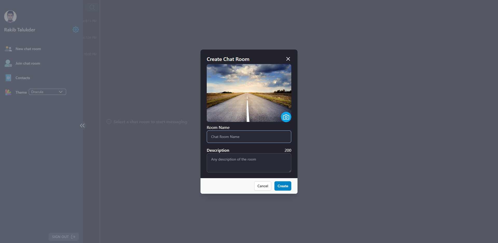

# Chatgram

A Telegram inspired chat app build with react, typescript and firebase.

Features:

-   One to one & group chat
-   Share media files such as image,video
-   Right menu click to copy,delete messages & download files.
-   Contacts
-   Create & join chat group.
-   Delete chat, leave group & clear history feature.
-   Forward message to another user or group.
-   Search for users and groups
-   User & group profile view
-   User profile update
-   Update group info as admin
-   Link preview & new message indicator
-   Tons of theme to chose.
-   Mobile responsive

ScreenShots:

---

## 

---

## 

---

## 

---

## 

## 

## 

